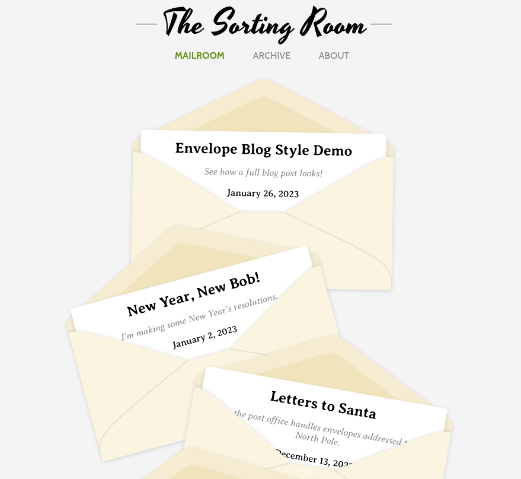

# Envelope Blog



A static blog with a snail mail theme, powered by 11ty and Netlify CMS. Deployed on Azure by GitHub Actions.

[**Click here for a demo version of the site!**](https://noahmpauls.github.io/envelope-blog/)

## Development Guide

To configure a local development environment, first run `npm install` to install dependencies. Then run the following two scripts in parallel:

- `npm run serve`: build the static site with 11ty, and watch for changes/rebuild when necessary
- `npm run local-cms`: run a local development Netlify CMS server to test the admin interface

## Deployment Guide

### 1. Configure deployment settings in `.env` file

The [`.env.deployment`](./.env.deployment) file at the project root defines several settings used during deployment workflows. These settings especially concern where and how the required resources are deployed to Azure. The required settings are listed below.

- **`DOMAIN`**: the custom domain that points to the deployed site (e.g. `www.envelope-blog.com`)
- **`RESOURCE_GROUP_NAME`**: resource group where resources will be created (e.g. `rg-envelope-blog`)
- **`RESOURCE_GROUP_REGION`**: the resource group's region (e.g. `centralus`)
- **`FRONTEND_APP_NAME`**: the name of the frontend app resources (e.g. `f-env-blog`)
- **`BACKEND_APP_NAME`**: the name of the backend app resources (e.g. `b-env-blog`)
- **`RESOURCE_SUFFIX`**: the suffix string appended to resource names to prevent resource name collisions (e.g. `20221109`)

### 2. Configure GitHub Actions secrets for Azure

A few more deployment configuration settings are stored in [GitHub Actions Secrets](https://docs.github.com/en/actions/security-guides/encrypted-secrets) for the repository. You will need to configure the following values as secrets:

- **`AZURE_SUBSCRIPTION_ID`**: the ID of the subcription where the Azure resources will be deployed
- **`AZURE_DEPLOY_CREDENTIALS`**: credential object giving contributor access to 

The subscription ID can be found on the overview page for the subscription in the Azure portal.

Deployment credentials are generated by creating an SPN in tenant with the necessary access for deploying resources and code. Using the Azure CLI, and after logging in with `az login`, run the following command:

```
az ad sp create-for-rbac --sdk-auth
```

This will create an SPN, and the `--sdk-auth` flag will cause the command to output a set of JSON credentials. The JSON output is the value to be added to the `AZURE_DEPLOY_CREDENTIALS` secret. For more information, read the Azure CLI docs about the [`az ad sp create-for-rbac`](https://learn.microsoft.com/en-us/cli/azure/ad/sp?view=azure-cli-latest#az-ad-sp-create-for-rbac) command.

### 3. Configure GitHub Actions secrets for Github

In this app, Netlify CMS connects to your GitHub repository, allowing you to log in using your GitHub credentials and make edits directly to the repository via the admin interface. The following values must be added as GitHub Actions secrets to enable these capabilities:

- **`OAUTH_CLIENT_ID`** 
- **`OAUTH_CLIENT_SECRET`**

These values are associated with an OAuth application registered with GitHub, which you must create. [Register a new OAuth Application](https://github.com/settings/applications/new) with the following settings, which recycle some of the settings from `.env.deployment` you configured before:

- **Homepage URL**: `https://<DOMAIN>`
- **Authorization callback URL**: `https://<BACKEND_APP_NAME>-<RESOURCE_SUFFIX>.azurewebsites.net/callback`

Copy the generated Client ID into the `OAUTH_CLIENT_ID` secret. Generate a new client secret, and copy that value into the `OAUTH_CLIENT_SECRET` secret.

### 4. Customize config data file

The [`_data/config.json`](./_data/config.json) file contains several fields that are used to personalize the site, such as the site title and the copyright notice details. Edit as required.

- **`name`**: the title of the site; displayed at the top of the page (e.g. `"Envelope Blog"`)
- **`copyright`**: settings for the copyright notice displayed at the bottom of the site
  - **`year`**: the year of the copyright notice (e.g. `2022`)
  - **`author`**: the copyright owner attribution (e.g. `"Bob the Mailman"`)

### 5. Customize admin interface config file

The [`admin/config.yml`](./admin/config.yml) file contains some configuration for the admin interface, where authors edit posts. Edit these details with the following settings, recycling some of the settings from `.env.deployment` you configured before:

```
backend:
  name: github
  branch: <github repository branch, e.g. 'main'>
  repo: <github repository owner/identifier; e.g. 'noahmpauls/mywebsiterepo'>
  base_url: https://<BACKEND_APP_NAME>-<RESOURCE_SUFFIX>.azurewebsites.net

site_url: https://<domain>
display_url: https://<domain>
```

### 6. Run your first successful builds

Until the above steps have been completed, site builds will most likely fail. From GitHub Actions, manually run both the frontend and backend deployment workflows with all deployment toggles checked. All resources should be successfully deployed, and your site will be available to view at the URL of the Azure static web app resource.

Note that there are additional steps required to configure your custom domain, so whatever custom domain you specified before won't yet work.

### 7. Configure your custom domain

Whatever custom domain you use will need to be configured to point to the Azure static site resource before it will work. [Follow the static site docs](https://learn.microsoft.com/en-us/azure/static-web-apps/custom-domain) to perform the necessary configuration with your domain registrar and with Azure.

### 8. Grant contributor access to all authors

If other users will be authoring/editing posts on the blog, you will need to ensure they have GitHub accounts, and make those accounts collaborators on the blog's repository. Once this step is complete, they will be able to log in to the CMS and create/edit posts.

### 9. Wrap-up: Edit "About" page and posts

Your blog should be up and running! To access the CMS interface, click the copyright notice at the bottom of the site. From the CMS, you can edit the "About" page to describe the site, and you can begin editing posts.

